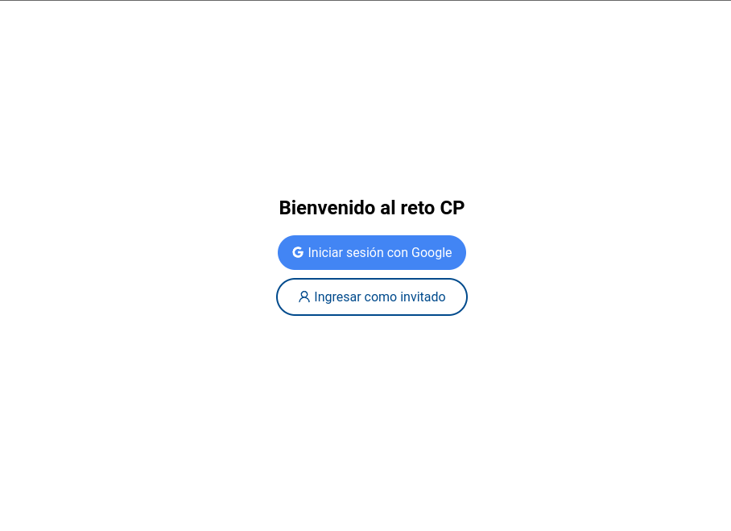

# Reto CP

web application that simulates a small purchase of movies

## Demo

Note: the api uses http, that's why the frontend can't be uploaded to a host due to SSL security.
To view the app, run the following commands below to view it locally

## Screenshots



## Tech Stack

**Client:** React, Sass, Context, LocalStorage

## Run Locally

Clone the project

```bash
  git clone https://github.com/Deyvis17GY/reto-CP.git
```

Go to the project directory

```bash
  cd reto-cp
```

Install dependencies

```bash
  yarn install
```

Start the server

```bash
  yarn start
```

## Environment Variables

To run this project, you will need to add the following environment variables to your .env.local file

`REACT_APP_API_KEY` = firebase api key
`REACT_APP_AUTH_DOMAIN` = dominio app firebase
`REACT_APP_PROJECT_ID` = project id
`REACT_APP_STORAGE_BUCKET` = project bucket
`REACT_APP_MESSAGE_SENDER_ID` = message sender
`REACT_APP_ID` = app id

Note: all variables are found when creating a new project in firebase
